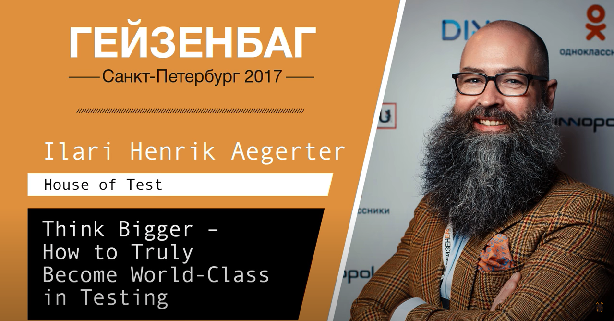

Every tester and QA engineer will ask himself at least once in his life: “What do I need to become a protester?”. Well, I get this question from beginner test engineers too. And, as always, I must say that thereare loads of answers, but one particular can be found in this video of Ilari Henrik Aegerter talk fromHeisenbug conference 2017.
I honestly suggest everybody find a spare 40 minutes and watch it.
It includes one of the most useful and interesting statements about what you need to become thebest tester.

[Video](https://youtube.com/watch?v=B8icsBgCWIs)